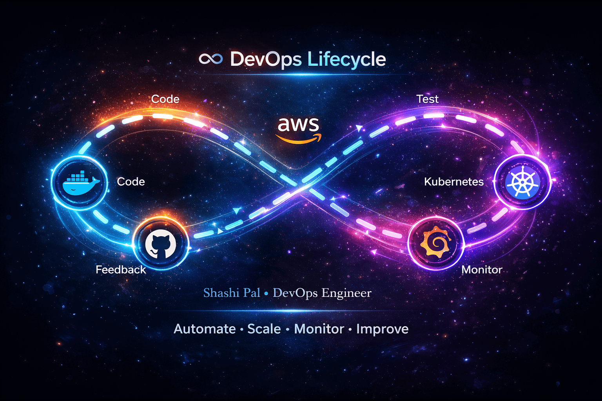
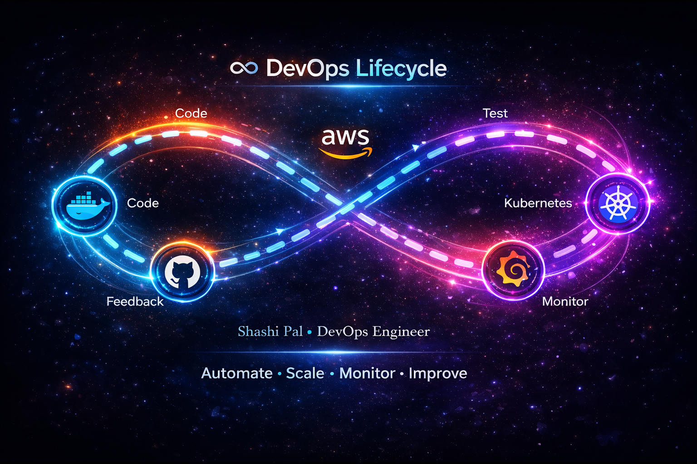

# 🚀 Shashi Pal — Senior DevOps | Cloud & Platform Engineering Leader

<p align="center">
  
</p>

<p align="center">
  
</p>

<p align="center">
  <strong>Openshift/OpenShift • Kubernetes • Linux • Ansible • Grafana • Azure,AWS,GCP • PYTHON</strong>
</p>

<p align="center">
  <a href="https://github.com/devopsgeek1979"></a>
  <a href="https://www.linkedin.com/in/shashi-pal1979/"></a>
  <a href="https://devopsgeek1979.github.io/devopsgeek1979/"></a>
</p>

<p align="center">
  <strong>🌐 Prefer a website view? Visit: <a href="https://devopsgeek1979.github.io/devopsgeek1979/">devopsgeek1979.github.io/devopsgeek1979</a></strong>
</p>

---

## 👋 About Me

```yaml
name: Shashi Pal
role: Senior DevOps Engineer | Platform Engineer
experience: 16+ years
focus:
  - Cloud Architecture (Azure, AWS, GCP)
  - OpenShift & Kubernetes Platforms on Linux
  - Infrastructure as Code (Terraform, Ansible)
  - Automation using PYTHON and modern CI/CD
  - CI/CD & Release Automation
  - Observability and Reliability Engineering
```

I build production-grade systems that are scalable, secure, observable, and resilient by design.

I help teams ship faster with reliable platforms, clear engineering standards, and automation that turns complexity into confidence.

---

## 🧭 DevOps Philosophy

<p align="center">
  
</p>

<p align="center">
  <strong>Design → Automate → Scale → Observe → Optimize ♾️</strong>
</p>

---

## ⚙️ Core Tooling

<p align="center">
  
</p>

---

## 📊 GitHub Insights

<p align="center">
  
  
</p>

<p align="center">
  
</p>

---

## 🏗️ What I Build

- **Cloud-native platforms** with automated provisioning and policy-driven controls
- **OpenShift and Kubernetes production stacks** with observability, security, and cost visibility
- **Linux-first automation workflows** powered by Ansible and PYTHON
- **Zero-touch CI/CD pipelines** for faster and safer software delivery
- **Self-healing infrastructure** with Grafana-led observability and automated remediation

---

## 🎯 Current Focus

- Advanced OpenShift and Kubernetes operations for cluster reliability
- Multi-cloud platform architecture (Azure + AWS + GCP)
- Platform Engineering and Internal Developer Platforms
- Observability and performance optimization at scale with Grafana

---

## 🧠 DevOps Creed

> Infrastructure should be invisible when working and transparent when failing.

---

⭐ If you care about robust systems, smart automation, and engineering excellence, you are in the right place.
